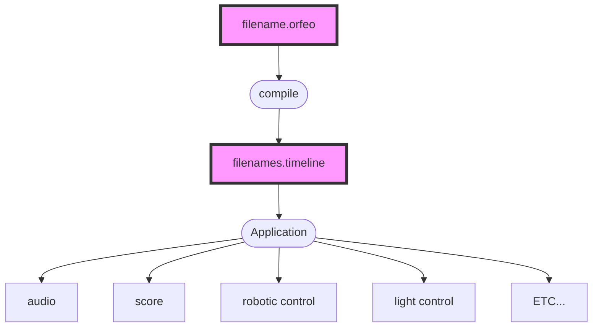

# Introduction

Orfeo is a programming language that permits you to organize data throughout time in a musical way. Music as organized data, or musically organized data! In the world of Orfeo, any kind of data can be music. Notes to be played on a piano is music. Chords to be played on a harp is music. Messages sent to a robot are music. Orfeo can be used for any application that uses data in time and wishes to organize it musically.

The goal of Orfeo is to give you control over data as if they were notes on a musical score. Orfeo is a musical score for data.

Orfeo is named after the ancient greek myth of Orpheus and used in its Italian spelling to reference the famous opera from Monteverdi called L'Orfeo often considered as the first opera.

## Workflow

An orfeo program is compiled giving a musicline file.



# Versioning

# Extension

Orfeo files use the .orfeo extension.

# La musica's entrance example....


------


The Orfeo Language


[!Version] 0.1.0
Introduction

"Language shapes the way we think, and determines what we can think about."
Benjamin Lee Whorf
Orfeo is a high-level domain-specific meta programming language designed to musically organize data for a temporal, spatial, or other kind of numerically divided line, e.g., a timeline divided in seconds, a spatial line divided in metres, a mass line divided in kilograms.

It aims to be a great tool for all types of musicians and does not require prior computer programming knowledge. Orfeo programs, also known as scores, are designed to look and feel like traditional music notation. The main difference is that you organize data instead of musical notes.

Orfeo programs, also known as scores, are designed to look and feel like traditional music notation, but instead of manipulating musical notes you manipulate data whose type is defined on a per application basis.

The main difference is that you organize data instead of musical notes.

In Orfeo,

The main difference is organizing data instead of musical notes.

data is deffined on a per application basis - give an example

talk about how the data is abstract daata can be note names, nummbers, configurations, etc… make your own applications anything an application desires.

rhythimcal accuracy - possible, and impossible. Tuplet Expressions

storing data

The Orfeo programming language is designed to feel musical. It mimics western notation in many ways. It is organized around Tuplet Expressions

Orfeo is a high-level domain-specific meta programming language for organizing data throughout time in a musical way. It aims to be a great tool for all types of musicians and does not require prior computer programming knowledge. Orfeo programs, also known as scores, are designed to look and feel like music notation. The main difference is organizing data instead of musical notes.

daata can be note names, nummbers, configurations, etc… make your own applications

anything an application desires. The main difference are you will be organizing data instead of musical notes and you will have much greater rhythmic precision for doing so.

s higher degree of rhythimcal accuracy and abstract data.

Orfeo is designed to help you musically organize your data in a fun and powerful way.

Orfeo aims to be a great tool.

It is designed to help

A tool for musicians s

high level meta language an abstract data manipulation language what are notes in orfeo…

daata can be note names, nummbers, configurations, etc… make your own applications

Once an Orfeo score is completed

Orfeo program (or score)

– What kind of laanguage, what does it do. – aspects o the language

text-based humaan reaadable laanguage

orfeo code is compiled to Eco files that caan be used by applicaations in a variety of ways.

what orfeo does organize data in a musical way how orfeo works

Orfeo is 60 a la noir at its base. (by default)

Note

A metronome is coming in v0.2.0!


### Jargon

Orfeo: A programming language.

MusicLine: Orfeo's compilation target.

Euridice: Orfeo's test suite.


## Comments

Orfeo has many different types of comments.

All these comment types start with the pound sign ```#```.

(word sigil)

### Single Line

A single line comment starts with a pound sign ```#``` followed by a
space. Anything after these two symbols and up to the end of the line
is a comment.

```orfeo
######################################################################

# This is a single line comment.

    #    This too is a single line comment.

(a b c d) # Again, a single line comment.
```

### Multi-Line comments

### Atomic comments

Atomic comments are used to comment out precise elements in the code.

They can comment out a duration, note, a metronome marking, a marker, etc...

```orfeo
    # Commenting out a duration.
(#=4 a b c d)

    # Commenting out the b and d notes.
(=4 a #b c #d)
```

### End of File comments

- Atomic should end with ( or )
- Do atomic comments work inside <>???
- What is double pounding it again? for ######


----------------------------------------------------------------------
----------------------------------------------------------------------

## Repeats

```orfeo
^.(: =4/4 a b c d | e f g h :)
```

```orfeo
^.(=4/4 a b c d | e f g h | a b c d | e f g h )
```

Should ```^.``` affect the entire ()... not the bar lines??
-- I think yes!!!
