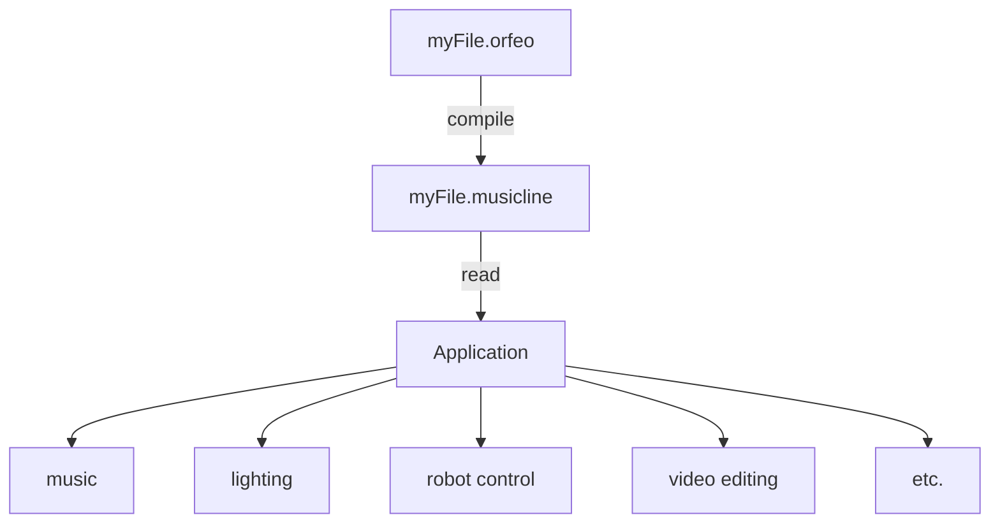

# Introduction

## Setup

### Editors

Any text editor can be used to write Orfeo code, but syntax
highlighters currently only exist for NeoVim, and Visual Studio Code.

[https://neovim.io](https://neovim.io) ⤴

[https://code.visualstudio.com](https://code.visualstudio.com) ⤴

## Extensions

Orfeo files use the ```.orfeo``` extension.

Musicline files use the ```.musicline``` extension.

## Versioning

The Orfeo programming language and accompanying applications are
versioned with Semantic Versioning 2.0.0.

Versions are numbered in three parts, x.y.z, which stand for
major, minor, and patch. The major number only increases
when breaking changes are introducted, the minor number is
for feature additions, and the patch number is for bug fixes.

Major version zero (0.y.z) is a special case for initial development.
Anything may change at any time. The goal is to avoid breaking changes
as much as possible, but until major version one, they are possible
in minor, and patch increases.

You can read the full spec here:
[https://semver.org/spec/v2.0.0.html](https://semver.org/spec/v2.0.0.html) ⤴

## Workflow

An Orfeo program file is compiled giving a Musicline file. This
Musicline file is then read by an application to either create a new
type of file, or some kind of behavior.



## Examples

### Orfeo, La Musica's Entrance


```orfeo
=4/2 ♩60

1 (1 <D5 'Dal'>) <D5~ 'mio'> (D5 <D5 'per-'> <D5 'mes-'>. <D5 'so a-'>^) |
<D5 'ma-'> <D5 'to'> (1 <D5 'a'>) (<C5 'noi'> <A4 'ne'>)                 |
<B♭4 've-'> <A4 'gno'>
```

```musicline
0    1 tempo 60
0    1 rest
2    1 rest
3    1 note D5 'Dal'
4    1 note D5~ 'mio'
6    1 note D5
6.5  1 note D5 'per-'
7    1 note D5 'mes-'
7.75 1 note D5 'so a-'
8    1 note D5 'ma-'
10   1 note D5 'to'
12   1 rest
13   1 note D5 'a'
14   1 note C5 'noi'
15   1 note A4 'ne'
16   1 note B♭4 've-'
20   1 note A4 'gno'
24   1 tail
```
